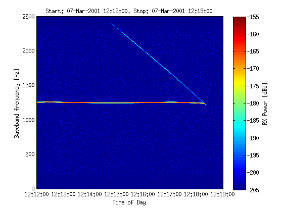

mgs-utils
=========

Mars Global Surveyor utilities(for radio occultation) 

This code is a little horrific, I'd redo it in Python if someone is interested.

Finding Data Files:
--------------------
Since this was a one-off exploration of something, I [manually picked which files to download](http://pds-geosciences.wustl.edu/missions/mgs/rsdata.html) based on the particular article I was reading.
I have included a couple *.lbl, *.sri files for you to try.

